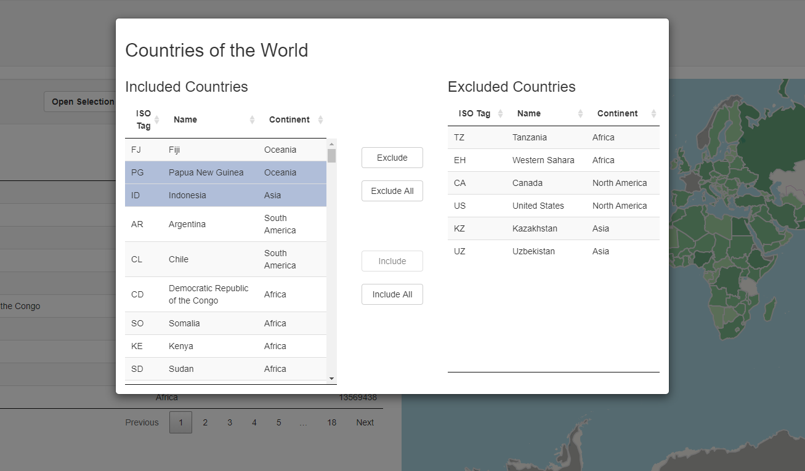

# Selection Modal
Sometimes it can be useful to filter out specific items from a data frame, or to only include specific items. This selection modal example provides functionality for filtering out specific observations from a dataframe as a part of the application interface, such that any outputs using this data will update to match the selection automatically.

Data can be included or excluded from the current selection, either individually or in bulk, using the selection modal interface.

You can try out the app [here](https://shiny.epi-interactive.com/apps/selection_modal)



## How it works
Load the selection modal functionality:
``` r
  source("EPISelect.R")
  source("EPISelect_server.R")
```


Load your data into a reactiveValues object. This will ensure that the outputs using the data will update when you modify your selection:
``` r
    includedData <- st_read(system.file("shapes/world.gpkg", package = "spData"))
    excludedData <- includedData[0, ]
    
    RV <- reactiveValues(inc = includedData, exc = excludedData)
```

Call the module within your server function, passing the reactiveValues object as an additional parameter:
``` r
    callModule(EPISelect, "data", RV)
```

Listen for the click and show a modal:
``` r
    observeEvent(input$show, {
        showModal(
            EPISelectUI(
              id = "data",
              modalTitle = "Countries of the World",
              includeTitle = "Included Countries",
              excludeTitle = "Excluded Countries"
            )
        )
    })
```

Ensure that any outputs are using the **included** (*inc*) part of the reactiveValues object
``` r
    world_table_details <- reactive({
      datatable(
                data = select(as.data.frame(RV$inc), iso_a2, name_long, continent, pop),
                rownames = FALSE, 
                colnames = c("ISO Tag", "Name", "Continent", "Population")
               )
    })
    output$world_chart <- DT::renderDataTable(world_table_details())
```

## Sources
* ["Countries of the world" shape data](https://rdrr.io/cran/spData/man/world.html)
